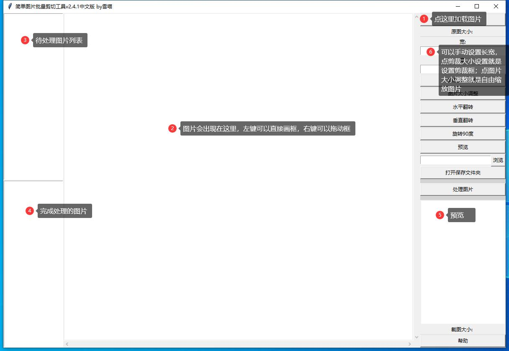

**Read this in other languages: [English](README.md), [中文](README_ZH.md).**

# update v2.4.2

Added the function of moving images with the scroll wheel and taking screenshots with the space bar

# Easy images cropping tool v2.4.1

When building a training dataset, cropping a large number of images is a tedious task, and existing tools and tutorials often have complex operations, and the accuracy of automated AI tools is not satisfactory. Therefore, I developed a semi-automatic image batch cropping tool.

This tool can efficiently batch process image cropping tasks, and users can achieve fast and fine-tuning continuous cropping by manually drawing sanctions or setting specific aspect ratios.

For images that are too large or too small in size, users can flexibly adjust them by setting the aspect ratio.

For oversized images, users can also move and select the cropping area by dragging the slider.

The software has multiple pre-processing options for flipping and rotating, and provides a cropping preview function to ensure that the cropping effect meets expectations.

After each cropping, the cropping box will be retained and users can easily move it by right clicking and dragging, which is particularly convenient for quick and same size cropping of different focal points in consecutive images.

Overall, this software achieves a "WYSIWYG" fast image cropping experience.

## Easy use guide

1.download "EasyImageCropper.exe" or “简单图片批量剪切工具.exe”(different languages)

2.Double click to open the program

3.Click on the "Load image" in the upper right corner and select the image you want to process

4.Set clipping box size

5.Left Click the mouse to point on the desired clipping area, or hold down the left mouse button to drag out a crop box

6.Click "Set Cropper Size" to get a regular sized cropping box.

7.Click 'Preview' to get a preview of the effect, or directly click Process Image（or click space bar） to complete the screenshot. The default save location is the folder where the original picture is located.

8.The next image will load automatically, hold down the right mouse button and drag the crop box to the new crop position.

July 4th 2024
