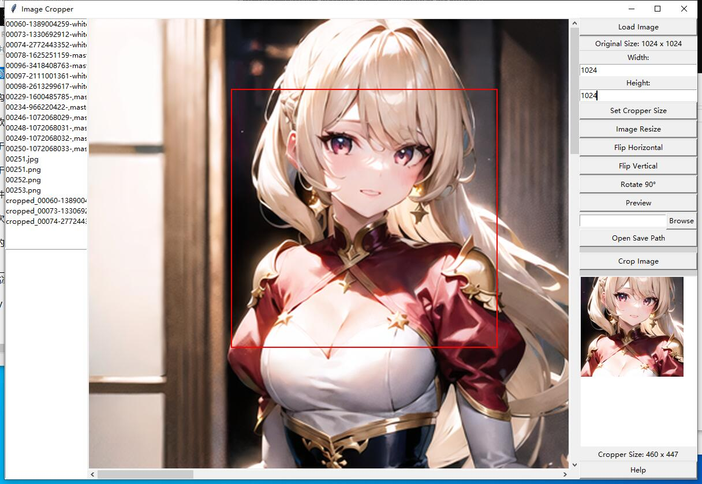
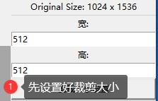
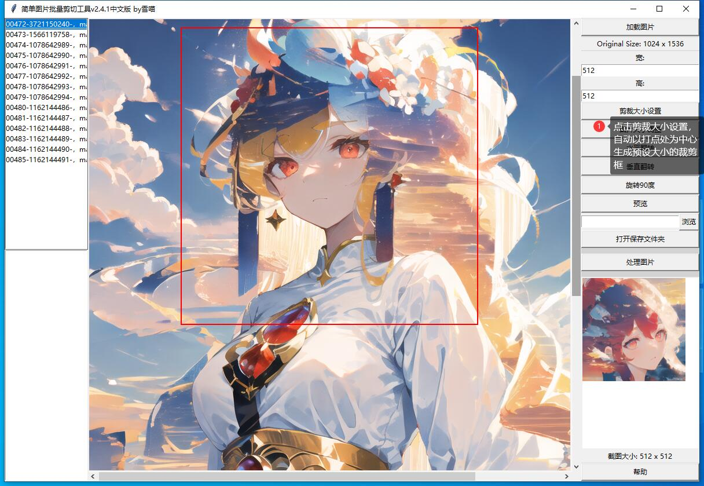
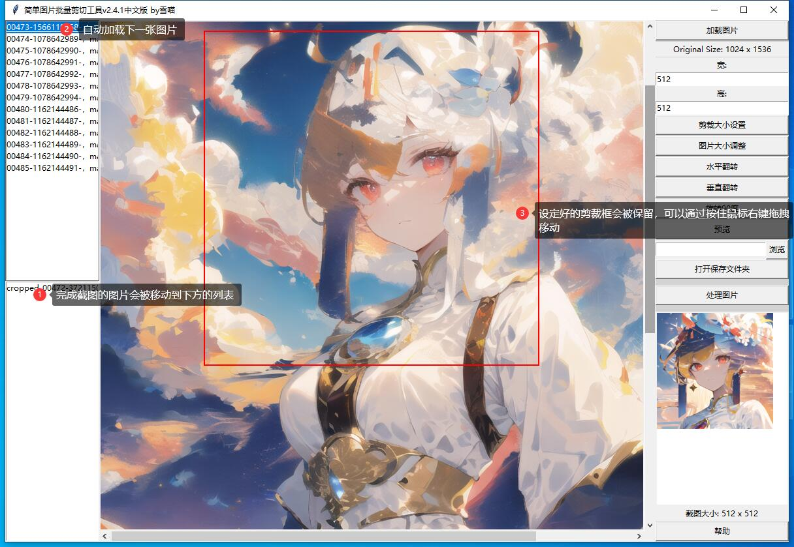

**其他语言版本: [English](README.md), [中文](README_ZH.md).**
# update v2.5

现在，在预览框处可以实时观察全图和切割框；
并且我保留了原来的预览功能，通过点击预览按键可以预览看剪切后的新图

# 更新 v2.4.2

添加了滚轮移动图片功能，和空格键截图

# 简单图片批量裁剪工具 v2.4.1

在构建训练数据集时，对大量图片进行裁剪是一项繁琐的任务，而现有的工具和教程往往操作复杂，自动化的AI工具精度也不尽如人意。因此，我开发了一款半自动的图片批量裁剪工具。

这款工具能够高效地批量处理图片裁剪任务，用户可以通过手动绘制裁剪框或设定具体的长宽比来实现快速且可微调的连续裁剪。

对于尺寸过大或过小的图片，用户可以灵活地通过设定长宽比进行调整。

对于超大的图片，用户还可以通过拖动滑块来移动并选择裁剪区域。

软件内置了多种翻转和旋转的预处理选项，并提供了裁剪预览功能，确保裁剪效果符合预期。

每次裁剪后，裁剪框会被保留，用户可以通过右键拖拽的方式轻松移动，这对于连续图片中不同焦点的快速同尺寸裁剪尤为方便。

总的来说，这款软件实现了“所见即所得”的快速图片裁剪体验。

## 简单使用指南

1.下载 "EasyImageCropper.exe"或者“简单图片批量剪切工具.exe”

2.双击打开程序

3.点击右上角的"加载图片"，旋转要处理的图片

4.设置剪裁框大小

5.单击鼠标左键在想要剪裁的地方打点，或者按住鼠标左键拖拽出一个剪裁框

6.单击"设置剪裁框大小"，获得尺寸规整的剪裁框

7.单击"预览"获得预览效果，或者直接单击"处理图片" (或单击空格键)，完成截图。默认保存位置为原图所在文件夹。

8.下一张图片会自动加载，按住鼠标右键，拖拽剪裁框到新的剪裁位置。

__________________________________
雪屋科技

July 4th 2024
